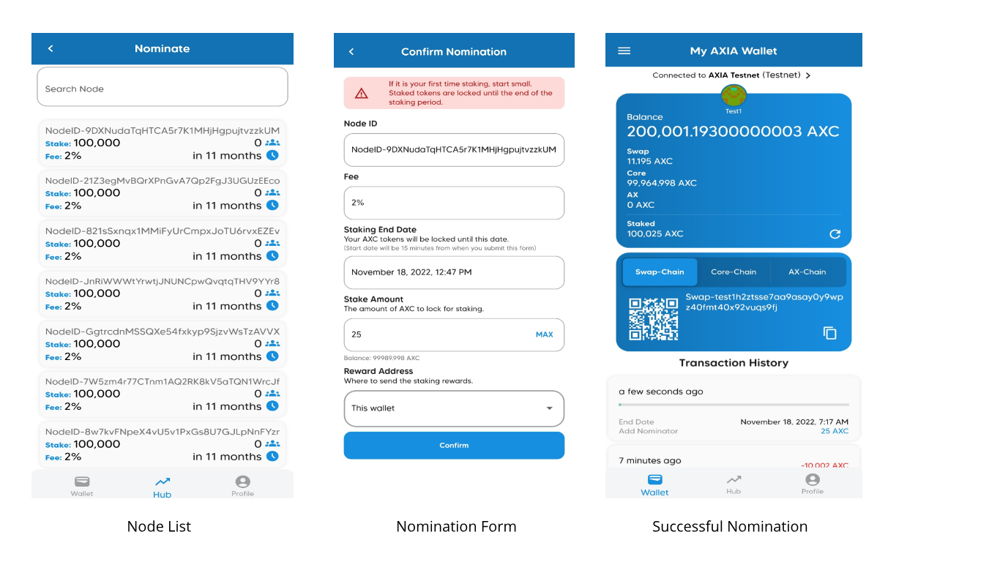

The AXwallet will be embedded in all applications in the AXIA Ecosystem.

The AXwallet is a free and secure tool that offers the ability to transact, exchange, buy, sell, hold, store, send and receive AXIA Coins. AXwallet is also the means through which users of AXIA Coin receive unparalleled benefits and rewards just for participating.

Once a person registers for their AXwallet, those credentials can be conveniently used for every application in the AXIA Ecosystem. Once the profile is created, the wallet is generated. From there, participants will have access to each application. This profile can be synced across all their hardware devices such as a phone, computer or tablet.

AXIA is providing greater efficiency and more upside potential along with favorable rewards and benefits for all people who come into the ecosystem who have generated an AXwallet.

The AXwallet can also be used to empower people to develop income for themselves. An AXIA Ecosystem participant can easily utilize the AXwallet as a tool to generate additional earnings and rewards from their own followers, subscribers, users, attendees, services and products they offer depending on the application within the AXIA Ecosystem. They can leverage any of the apps to their advantage to pursue their own entrepreneurial goals just by maximizing the additional utility offered by having the AXwallet embedded in all the applications.

All activity taking place in the AXwallet within the AXIA Ecosystem can be settled instantaneously, and completed in a more cost-efficient manner than if conducted outside the AXIA Network. Moreover, there is the simultaneous added advantage that this activity will direct value back to strengthening AXIA Coin itself through the mechanism of coin burning leading to the reduction in Total Supply.

## Interacting with AXwallet 

AXwallet is an application that allows one to store private keys and sign transactions for AXIA Network. The integration of a AXwallet with AXIA network allows for simple and easy access to private keys and signing transactions. Following are the official AXwallet applications we can find on Android: 

### Supported Wallets
| AXwallet                                                         | Development State | Description       |  Supports |
| ------------------------------------------------------------------- | -----------------| ----------------- |  -------- |
| AXwallet |Testnet Access              | [iOS](https://apps.apple.com/us/app/axwallet/id1604038953) and [Android](https://play.google.com/store/apps/details?id=com.axia.wallet)   |  Staking  |
| AXwallet Web         | Live                  | [Browser](https://wallet-v2.testnet.axiacoin.network/)           | Staking  |

### Create Account

This guide will consider you have already downloaded the AXWallet from the Play store or App store. After that you have the login page with an option of logging in through your contact number or email address. 
And also it has an account create option. 

After clicking create account, you will have a similar option to create with contact number or email address. Choose as per your preference as the process is similar for both. 

Enter the details which are required in the account creation and press send verification code. You will receive OTP via SMS or email depending on what you have chosen earlier. 

Then, you will get the option of creating a new wallet or importing the wallet. 

Create an account and backup the mnemonic somewhere safe. Also, you need to verify some of the mnemonic words as a security measure. After that set a PIN to lock the wallet app. You need to enter that PIN or your biometrics( Face id/ Fingerprint) whenever you want to access the wallet.

### Import Account

Import account will have the option to enter the mnemonic. Enter your saved or backed up mnemonic and access your wallet. You can also scan the QR code of the account and access that way too. 

## Functionalities in Wallet

The basic functionalities are present in HUB which include Same Chain Transfer, Cross Chain Transfer and Nominate. 

### Same-Chain Transfer

In this section, we can transfer AXC from swap-swap chain or AX-AX chain. This is used to do transfers from one wallet to another. 

1. Go to Hub and select “Same Chain Transfer” .
2. Enter the transfer amount and the address you want to transfer. Make sure the address is entered correctly.
3. Click on Transfer and the transaction will be successfully done. 

### Cross-Chain transfer

This is done in your own wallet only. And with this, you can transfer AXC from one chain to another. Combinations for cross chain can be anything like -
- Swap -> Core
- Swap -> AX 
- AX -> Core
- AX -> Swap
- Core -> Swap
- Core -> AX

Make sure you have enough funds to transfer from one chain to another including the transaction fee. 

1. Go to Hub and select Cross-Chain transfer.
2. Select the source chain from where you want to transfer the funds and select a destination chain where the funds will be received.
3. Source or destination can be any chain which includes Swap, Core and AX. 
4. Click transfer and the cross chain transfer will be successfully done. 
5. Now go to the Wallet section ( homepage) and scroll down for the transaction history. You will find this cross chain transfer transaction details at the top of the list. 
6. Click on it and find the details of the same transaction in the explorer too. 

### Nominations

Staking AXC is also available in AXwallet. Staking is the process of bonding AXCs to a validator to support a network while receiving a reward in return this process is called nomination. A nominator can select a particular validator from the validator list and nominate them by staking their AXC Coins. When they do so, they are vouching for that specific validator, and the nomination is a signal of trust in the AXIA Network. 

1. Go to Hub and select Nominate. 
2. A Node list will open up. Select the node as per your requirement. 
3. A nomination form will open up. Fill the details as required. 
4. You will find the nomination details in the transaction history section on the homepage. 

### Switching between Mainnet and Testnet

First we need to select between Testnet and Mainnet. Please check this before making any transactions. 

Press the “Connected to AXIA” button below the My AXIA Wallet in the home screen to select either Testnet or Mainnet. 

[AXIA Support](https://discord.gg/axianetwork) - Connect with our community of experts to learn or ask.

