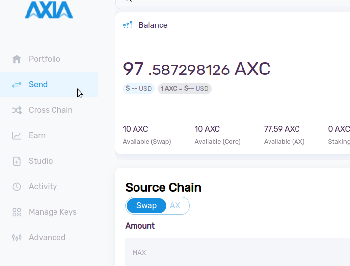
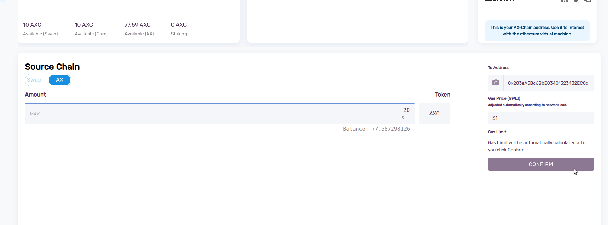
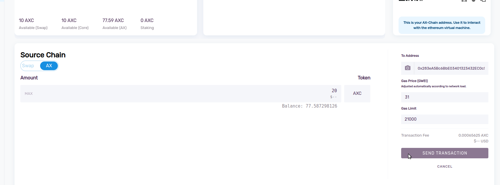
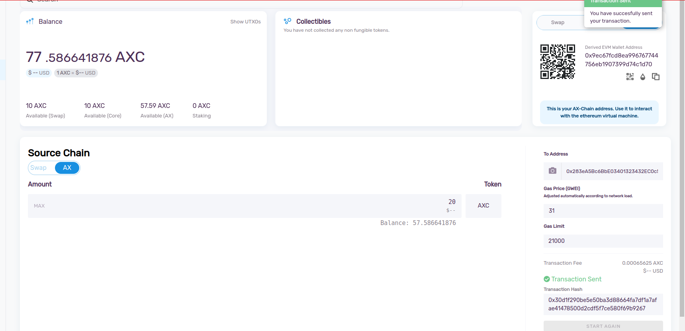

## Introduction
Transfer funds is always a important function for any wallet. Now it is very easy and secure to transfer AXC from one AXIA wallet to another AXIA wallet. In this guide we will how easily and safely we can transfer AXC.

### Blance Transfer Procedure in AXIA Wallet:
Select the "Send" option from the sidebar.

Transfer Balance is only possible from the Swap Chain and AX Chain. Select Swap Chain or AX Chain to transfer AXC. Make sure you have some AXC in these chains.

Enter an amount you want to transfer and the addess of the reciever account in the "To Address" section. Gas Price will automatically calculated by the network. The "Confirm" your transaction.

In the next wizard you can see the transaction fee. Click "SEND TRANSACTION" to transfer the AXC. Check the reciever address and the amount again before sending the transaction. Once a transaction is confirmed it cannot be reverted.

Your transaction is confirmed and a Transaction Hash is generated. 

In the case of Swan Chain transaction you can check the transaction from [AXscan Explorer](https://axscan-v2.testnet.axiacoin.network/) and for AX Chain transaction you can navigate to [AXChain Explorer](https://appchain-v2.testnet.axiacoin.network/) for transaction details.

 [AXIA Support](https://discord.gg/axianetwork) - Connect with our community of experts to learn or ask.
