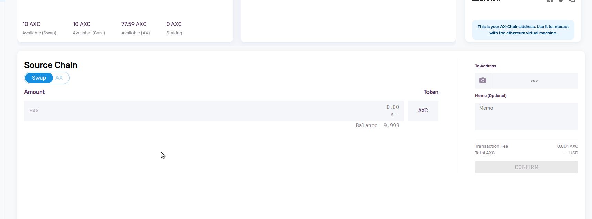

## Introduction
Transferring funds is always an important function for any wallet. It is very simple and secure to transfer AXIA Coin from one AXIA Web Wallet to another. In this guide we will share information on how to easily and safely do so.

### Balance Transfer Procedure in AXIA Web Wallets:
Select the "SEND" option from the sidebar.

Balance transfers are only possible from the SwapChain and AXChain. Select SwapChain or AXChain to transfer AXIA Coin. Of course, make sure you have some AXIA Coin in these chains before you begin.

Enter an amount you want to transfer and the addess of the reciever account in the "TO ADDRESS" section. The gas price will be automatically calculated by the network. Select "CONFIRM" to continue.

In the next section you can see the transaction fee. Once you're satisfied with the details s, click "SEND TRANSACTION" to transfer the AXIA Coin. Check the reciever address and the amount again before sending the transaction; once a transaction is confirmed it cannot be reverted.

Your transaction is now confirmed and a transaction hash will be generated. 

In the case of SwapChain transactions you can check the transaction from [AXscan Explorer](https://axscan-v2.testnet.axiacoin.network/) and for AXChain transactions you can navigate to [AXChain Explorer](https://appchain-v2.testnet.axiacoin.network/) for details.

 [AXIA Support](https://discord.gg/axianetwork) - Connect with our community of experts to learn or ask questions.
