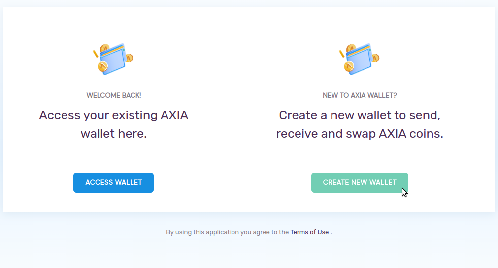
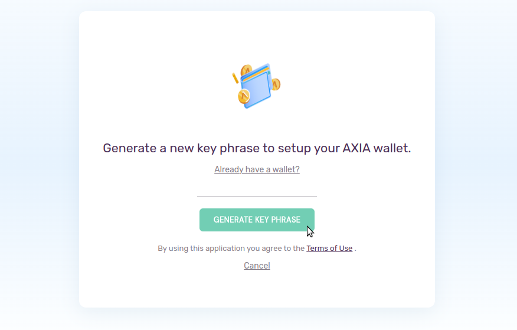
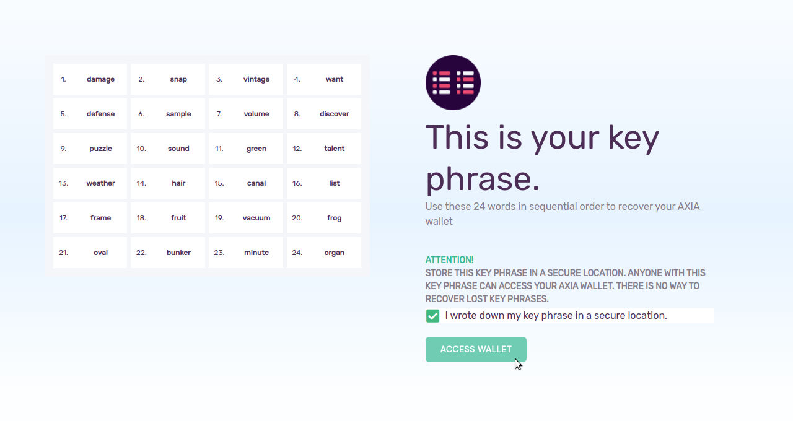
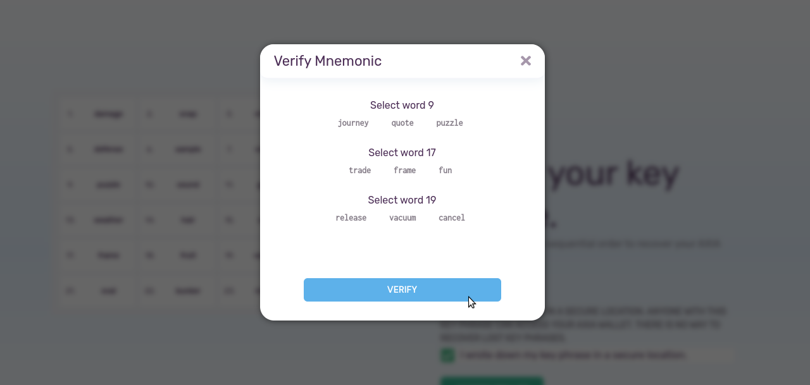
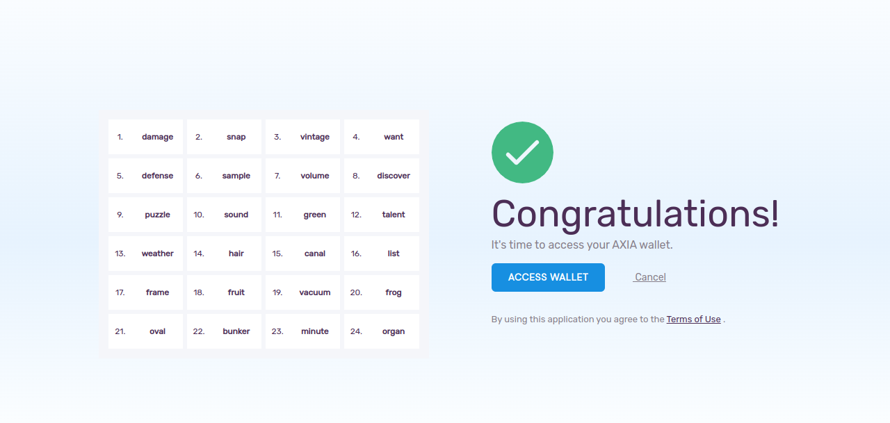
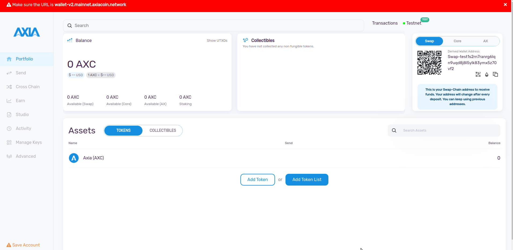
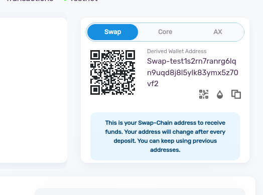
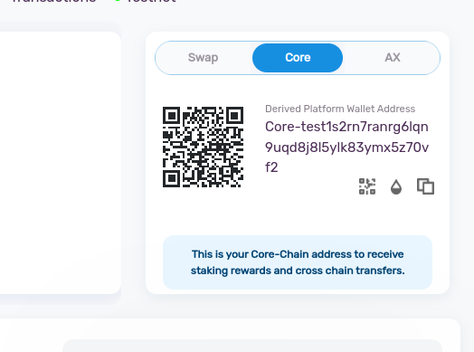
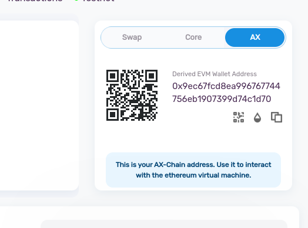

If you don't have any AXIA Web Wallet previously you can create a new one from [AXIA Web Wallet](https://wallet-v2.testnet.axiacoin.network/). Select the 'CRETAE NEW WALLET' option. 

It will redirect to the next wizard to generate key phrase. In order to set up an AXIA Wallet you need to generate a key phrase. Click on the 'Generate Key Phrase' option.

After that it will show a random 24 words mnemonic key phrase. Write down or store the mnemonic key phrase in a safe place as it will require to restore your account in future. Click on "ACCESS WALLET".

In the next phase you need to verify that Mnemonic. This process is for the security and safety of your wallet. You need to select three words from the mnemonic you have already stored according to that number. Then verify it.

If you select the right words, congratulations your wallet is created and you a part of our AXIA ecosystem.

Your wallet will look like this.

Your wallet is connected with all the three block chains of AXIA's primary network. You can see all the three addresses of your wallet in the top right corner. This is **Swap Chain** address. The Swap Chain is a decentralized platform for creating and trading the AXIA native token AXC.

This is the **Core Chain** address of the wallet. The Core Chain coordinates network validators and can be used for staking on the AXIA Wallet.

Lastly you can see the **AX Chain** address. The AX Chain allows users to create smart contracts and interact with DApps and DeFi services.

 [AXIA Support](https://discord.gg/axianetwork) - Connect with our community of experts to learn or ask.
