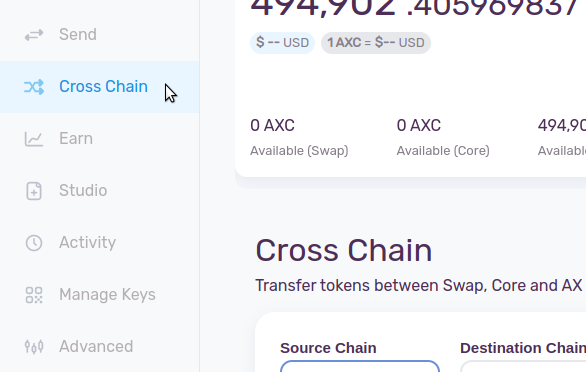
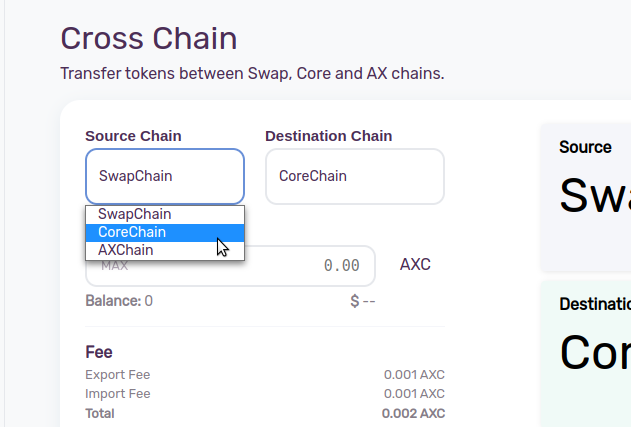
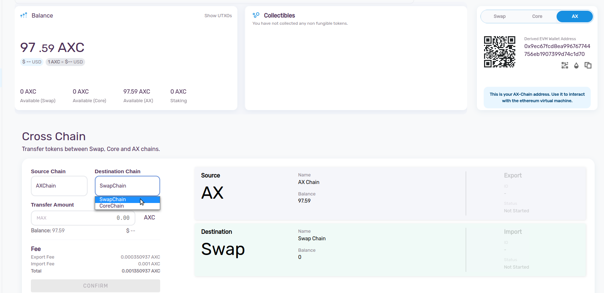
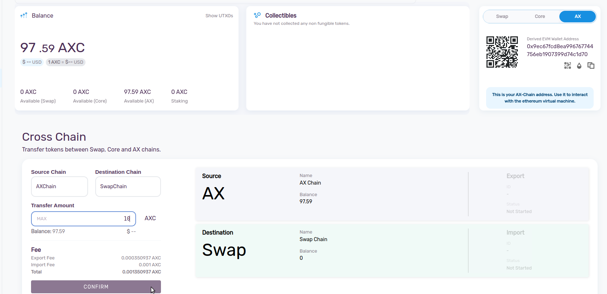
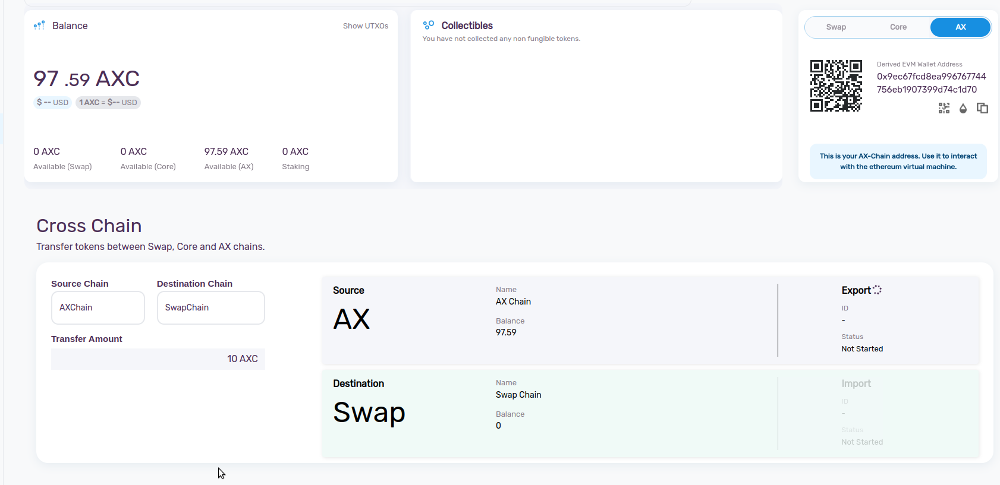
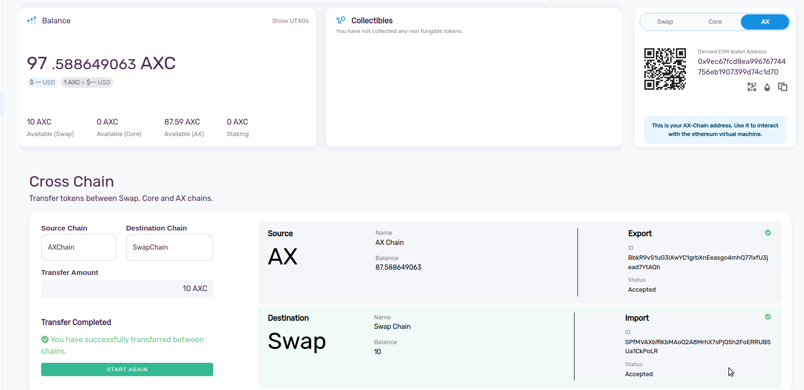

As we see there are three blockchains(CoreChain, AXChain, SwapChain) in [AXIA Network](../docs/The-AXIA-Network). Every chain has some distinct function. Cross Chian transfer is the transfer of AXC from one chain to another chain within the AXIA Network. This Cross Chain feature will provide more safety and scalability to the network.

## AXIA Network Structure
### CoreChain
CoreChain would be considered the layer-0 blockchain protocol that supports and accommodates multiple layer-1 AllyChains as well as the SwapChain and AXChain CoreChain acts as a middleware chain on AXIA network which manages all the Validators and communications, The Core Chain coordinates network validators and can be used for staking on the AXIA Wallet.

### AXChain
The AXChain maintains a state, which is a direct mapping of account details, balances and counters of transactions. AXChain will allow developers to easily build dApps and other applications on top of the AXIA Network offering a new level of convenience for users and assets to exist across multiple blockchains and provides greater compatibility with the AXIA Network AllyChain environment. AXChain is a EVM implementation that has its own ledger which is secured and validated through CoreChain Validators.

### SwapChain
SwapChain is built with AVM (AXIA Virtual Machine) which provides support for creating and exchanging digital properties, it is a digital twin for the real world instruments with each having a predefined set of rules. Network fees will be required for the creation and exchange of these digital instruments.

### How to Perform Crosschain Transaction in AXIA Network :
Navigate to the "Cross Chain" section from the sidebar.

In the next step. Choose CoreChain, AXChain or SwapChain as your Source Chain.

If you choose one chain as a source chain other two chain except your source chain will be the destination chain.
For example you choose AXChain as your Source Chain your destination will be Swap Chain or Core Chain. Select the Destination Chain as per the requirement.

Enter the amount you want to transfer and the "Confirm" it.
:::note
Very small amount of transaction fees will be applicable for the crosschain transfers.
:::

After confirming you will see the amount will first Export from the Source Chain and then it will Import in the Destination Chain. Also a ID will be generated for each operation.

Within few seconds the transaction will be complited and the balance will be reflected in that specific chain.

 [AXIA Support](https://discord.gg/axianetwork) - Connect with our community of experts to learn or ask.
