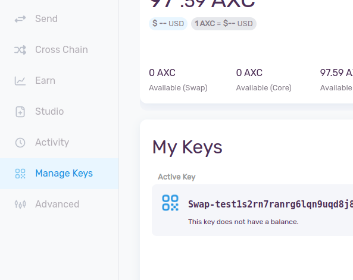
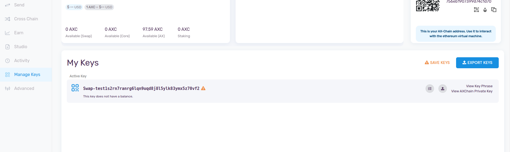
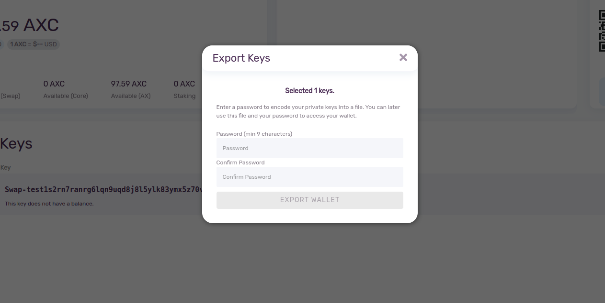
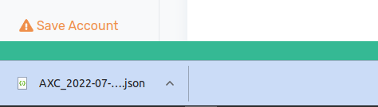

### Introduction
In this section you will know how to manage and store your wallet keys. In the case you want to restore the account you need these keys to verify the your ownership. Make sure you store these keys in a safe place for future use.

### How to Export Key:
Go the the 'Manage Keys' from the sidebar.

Click on 'Export Key' blue logo on the right hans side, just under the wallet address section.

It will ask for a password to export the wallet key and select "EXPORT WALLET" option. 

Right after that a JSON file will be downloaded in your system. Place this in a safe folder. Remember this will be required in the case of restoring the wallet.

 [AXIA Support](https://discord.gg/axianetwork) - Connect with our community of experts to learn or ask.
