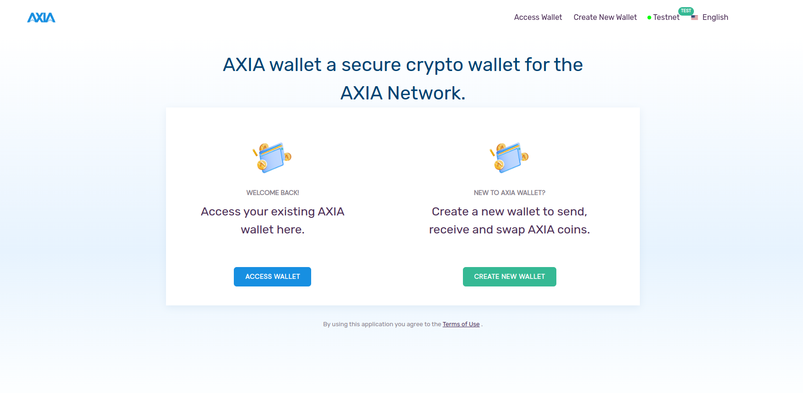
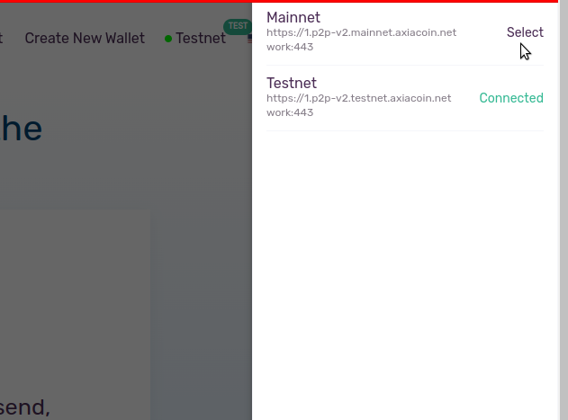
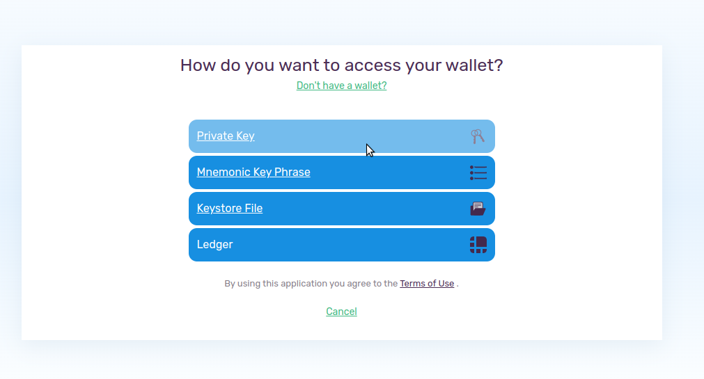
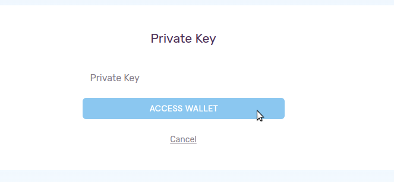
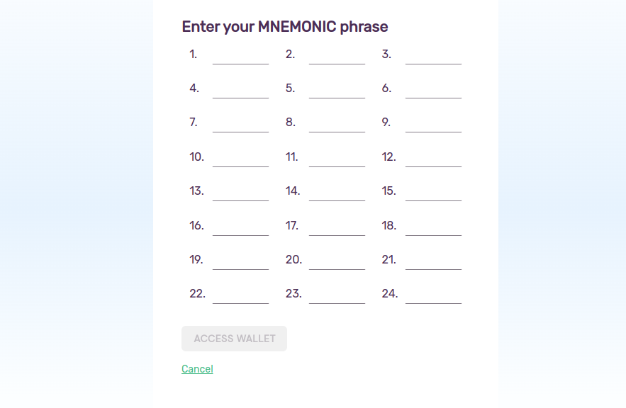
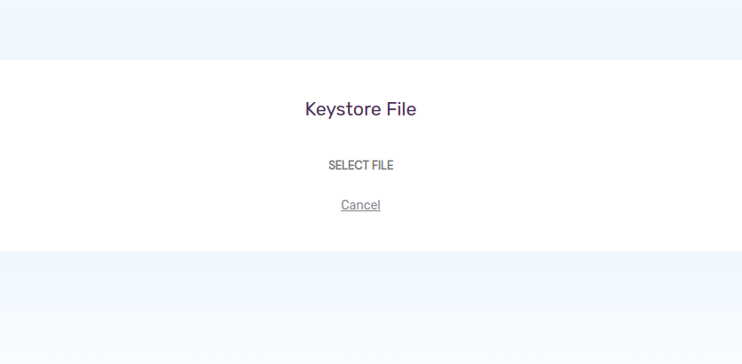

If you previously had an AXIA Web Wallet, you don't have to create another one. There are some methods to import your previous wallet. At first you have to open the [AXIA Web Wallet](https://wallet-v2.testnet.axiacoin.network/)

Then select the network (Testnet/Mainnet) from the top right corner.

After it select the 'Access Wallet' section, it will take you to another wizard where you can see optios to import your previous wallet.

1. You can access your previous wallet through 'Private Key'

2. You can use 24 words 'Mnemonic Key Phrase' to restore your account.

3. Also you can upload the Keystore JSON file to access your old account.

 [AXIA Support](https://discord.gg/axianetwork) - Connect with our community of experts to learn or ask.
