## Introduction
Developers can leverage the Ethereum compatibility of AXIA to integrate tools such as MetaMask into their DApps. By doing so, they can use the injected library MetaMask provides to interact with the blockchain.
MetaMask allows users to store and manage account keys, broadcast transactions, send and receive Ethereum-based cryptocurrencies and tokens, and securely connect to decentralized applications through a compatible web browser or the mobile app's built-in browser.

### Install the MetaMask Extension

First, you will need to install MetaMask. After downloading, installing and initializing the extension, follow the Get Started guide. 

1. Go to https://metamask.io/download.html
2. Click 'INSTALL METAMASK FOR CHROME'

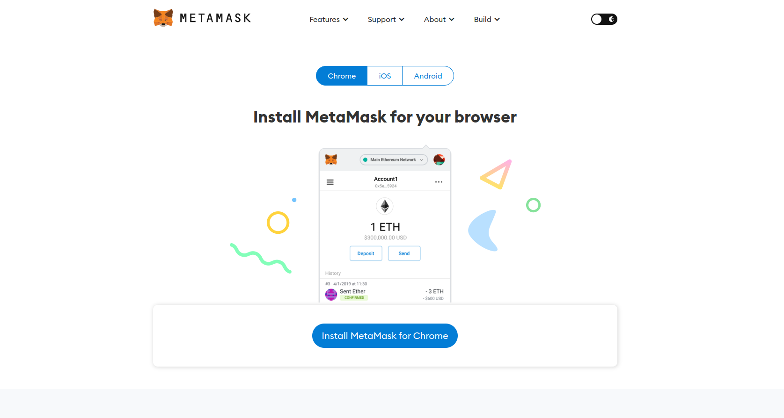

3. Click 'ADD TO CHROME'

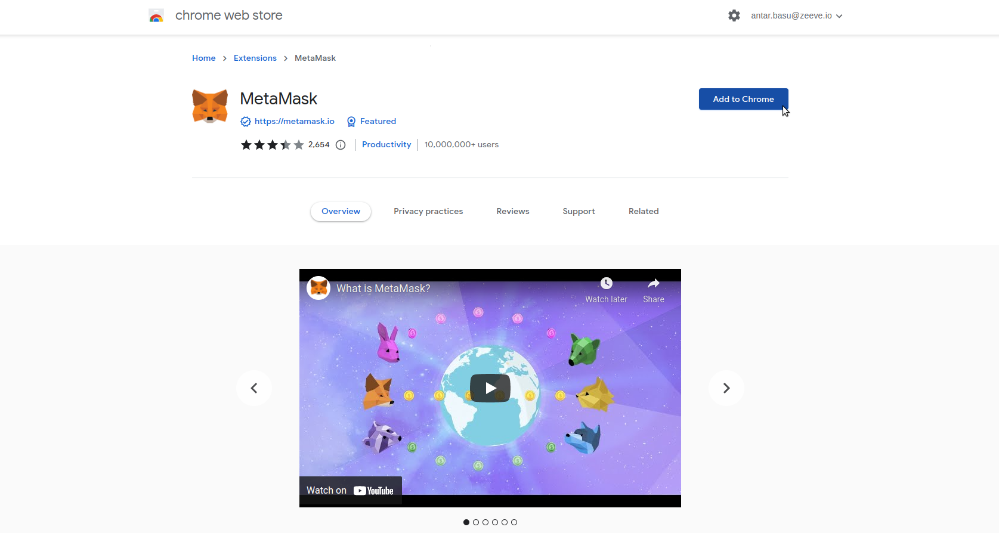

4. A window will pop up. Click 'ADD EXTENSION'

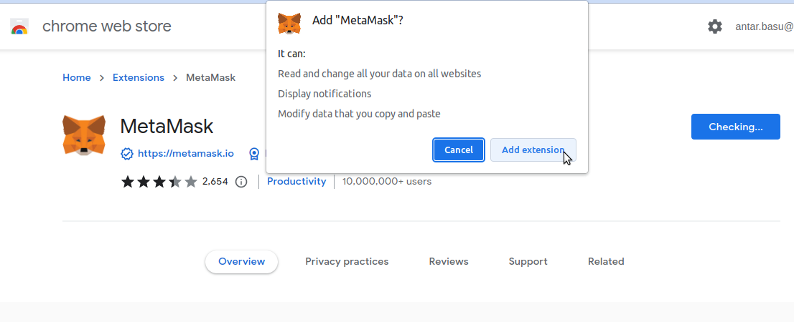

After a few seconds you will be automatically redirected you to the MetaMask Quick Start site

### How to Import or Create a Wallet in Metamask

1. Click 'GET STARTED'

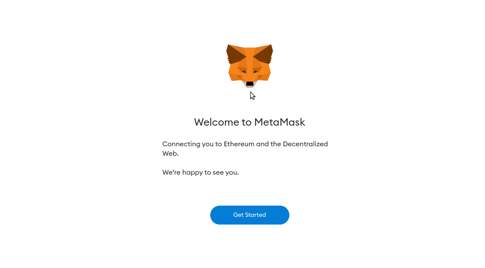

You will see a page like this:

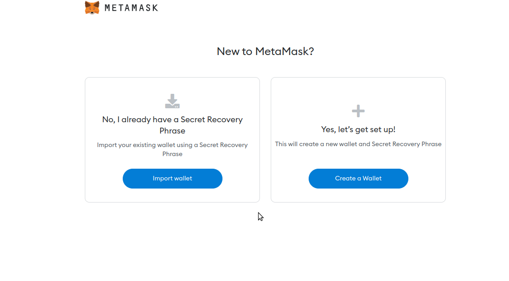

### Import Previous Wallet

1. If you already have a wallet, select 'IMPORT WALLET'
2. Then, click 'I AGREE'
3. Fill in the Secret Recovery Phrase section

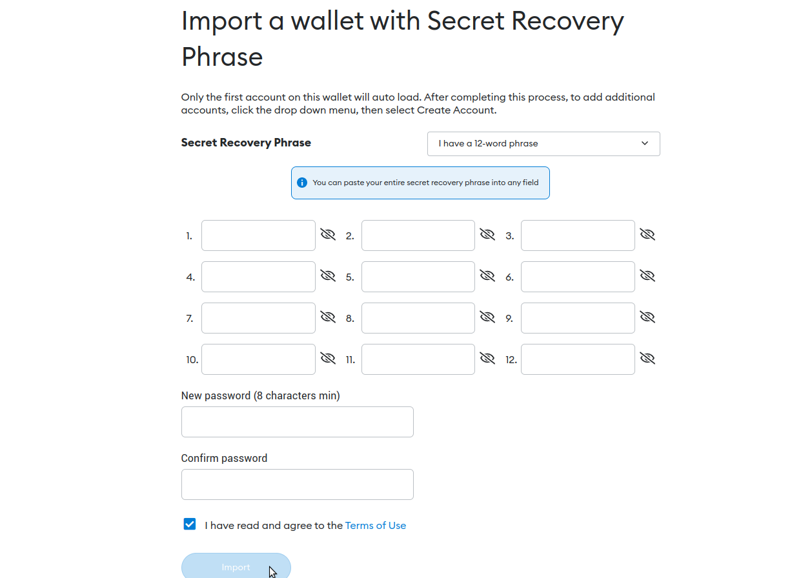

4. Fill in the New Password section
5. Fill in the Confirm Password section with the password you created
6. Click 'IMPORT'

Your previous wallet will be successfully imported.

### Create A New Wallet

1. If you don’t have a previous wallet, select 'CREATE A WALLET'
2. Click 'I AGREE'
3. Fill in the New Password section
4. Fill in the Confirm Password section with the password you created
5. Tick the 'I HAVE READ AND AGREE TO THE TERMS OF USE' box
6. Click 'CREATE'
7. Press 'NEXT'

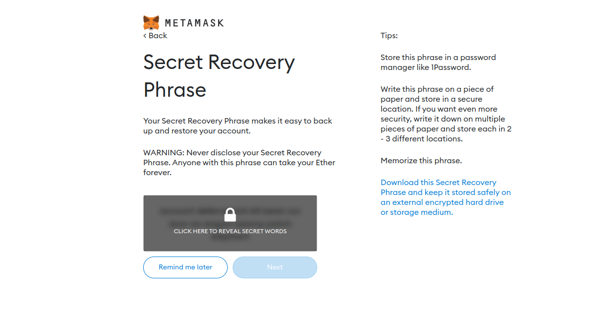

12. Click on the lock symbol and then select 'CLICK HERE TO REVEAL SECRET WORDS'

:::note

Store your phrase in a secure place as it will required to help you to recover the account later.

:::

9. Select the words of the phrase that you've saved accordingly
10. click 'CONFIRM'
11. Click 'ALL DONE'

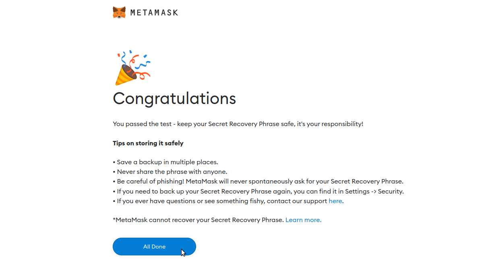

A new wallet will now have been created successfully.

### Connect Metamask AXIA

1. Click on the Network dropdown right before the account logo

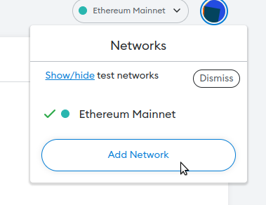

2. Click 'ADD NETWORKS'

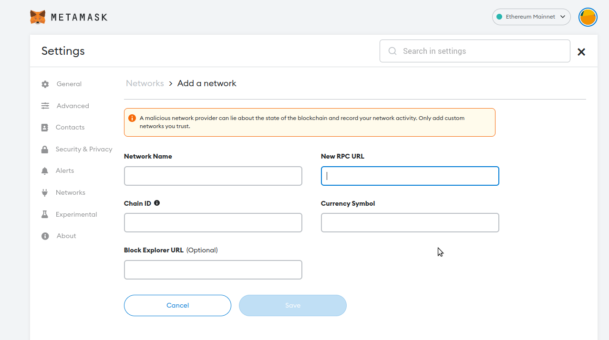

Here, you can add the network.

To connect with the AXIA Network (Testnet) the parameters are:

- Network Name - AXIA Testnet
- RPC URL - https://rpc.testnet.axiacoin.network/ext/bc/AX/rpc
- Chain ID - 4000
- Currency Symbol - AXC
- Block Explorer URL - https://axscan-v2.axiacoin.network/?network=Testnet

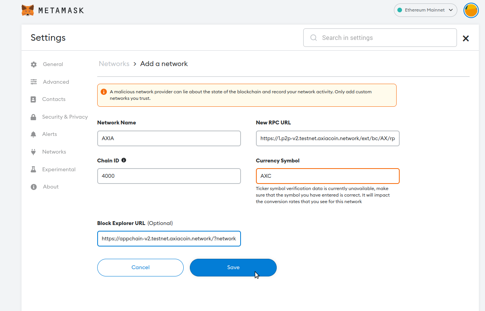

3. Now, save the network. 

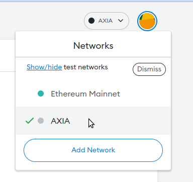

You can see a new network is added to the list and now you can switch to the AXIA Network anytime.

### How to Import Account

1. Click the round account logo at the top right corner.

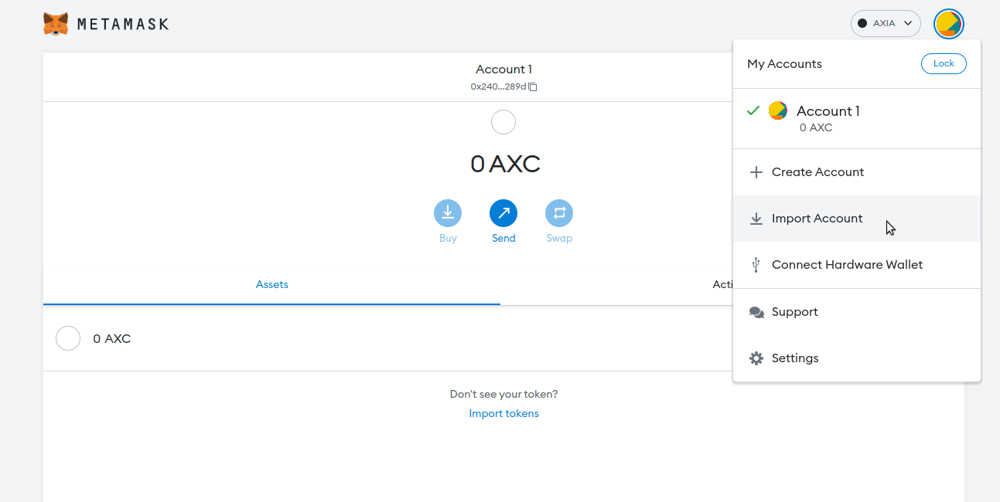

2. Select 'IMPORT ACCOUNT'

3. Select 'TYPE' and then 'PRIVATE KEY' 

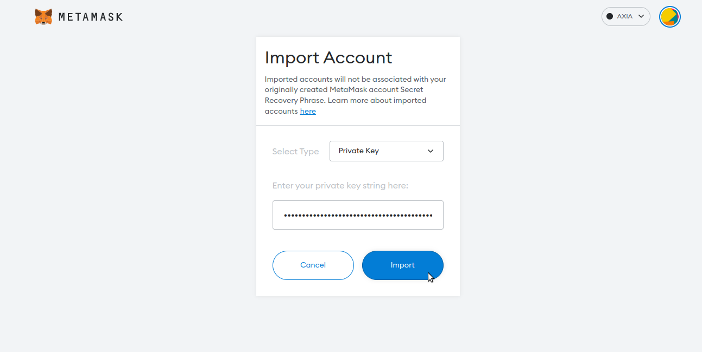

4. Paste your private key string into the box 
5. Click 'IMPORT'

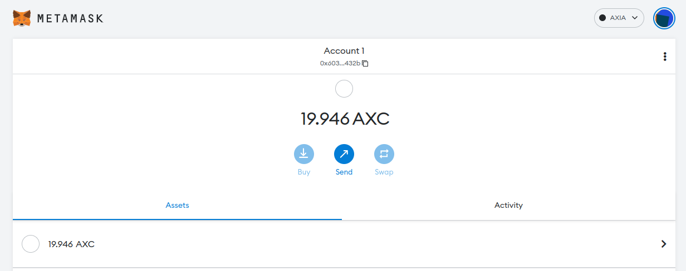

Your old account will be imported. If you previously had any AXIA Coin, it should appear.

## How to Transfer tokens from one account to another

1. Click the round account logo in the top right corner
2. Choose an account that has some tokens
3. Enter the public address of the account you want to transfer to

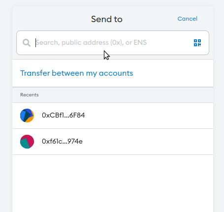

4. Enter the amount and click ‘NEXT'

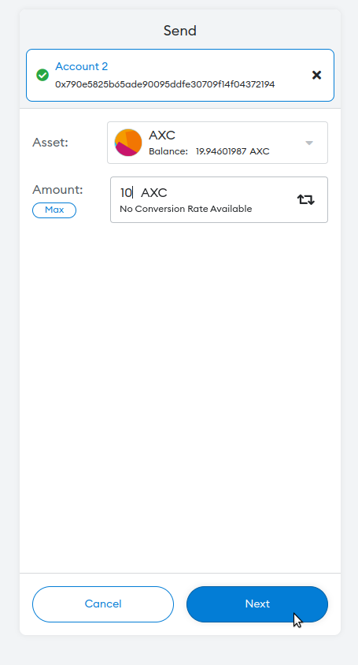

5. The Network will estimate the gas fee and it will be added with the transaction amount you want to send. Press ‘CONFIRM.'

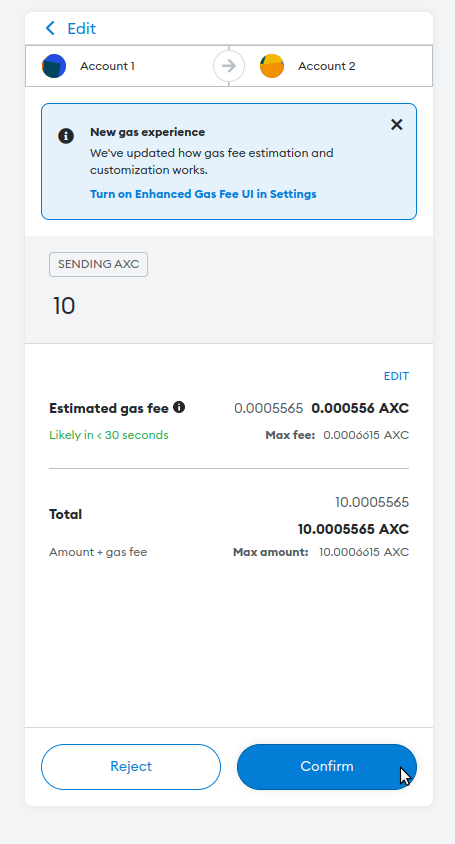

6. Once you have submitted the transaction you will see it pending until it is confirmed, as shown in the following image:

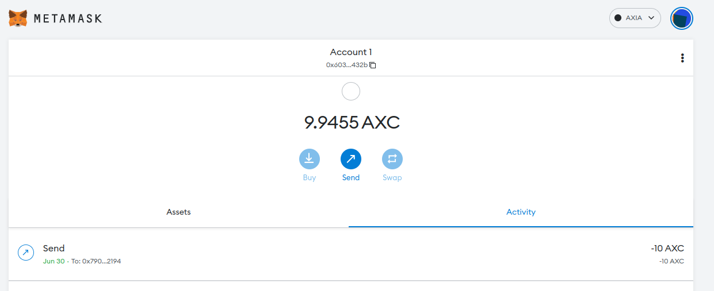

:::note

The Account 1 balance has been decreased by the sent amount + gas fees.

:::

You can copy the Transaction ID and check it in the [AXChain Explorer](https://axscan-v2.axiacoin.network)

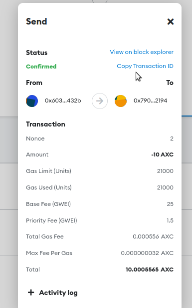

Paste the Transaction ID on the top search bar of the Explorer and press ‘ENTER.'

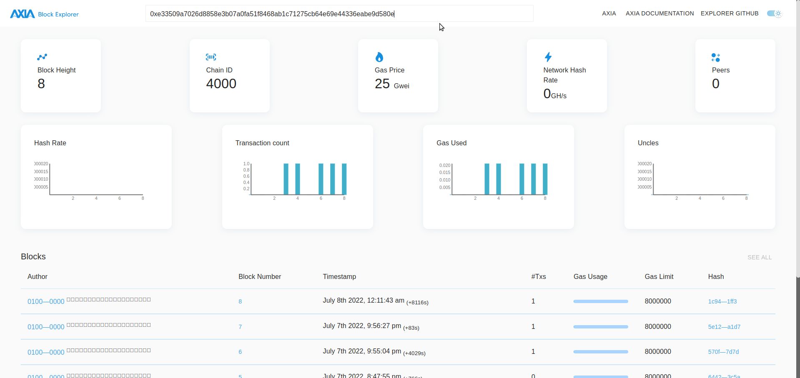

The explorer will show the necessary details about the transaction.

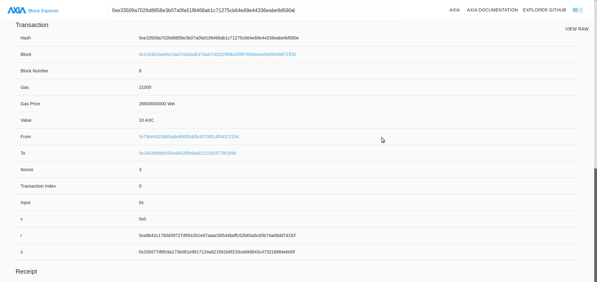

 [AXIA Support](https://discord.gg/axianetwork) - Connect with our community of experts to learn or ask questions.

