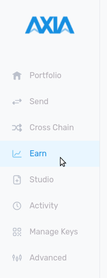
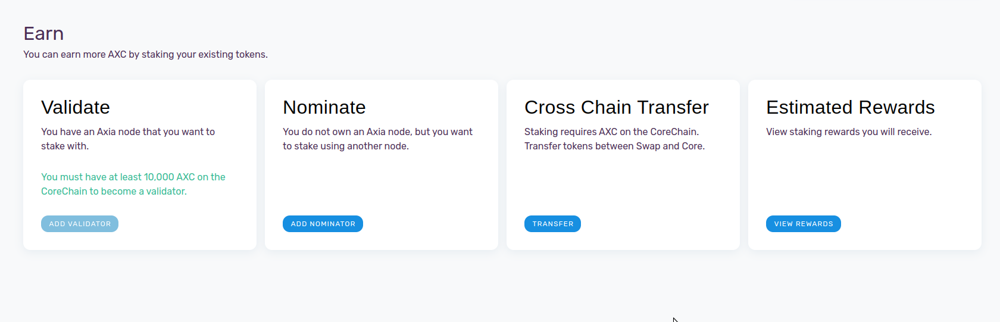
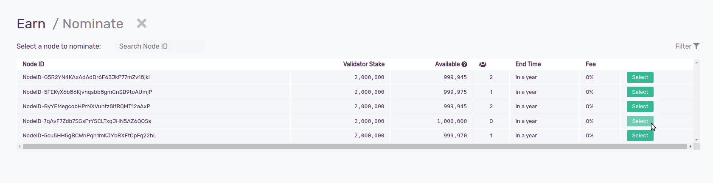
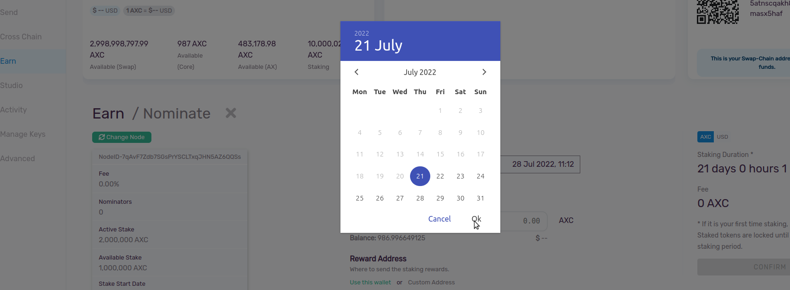
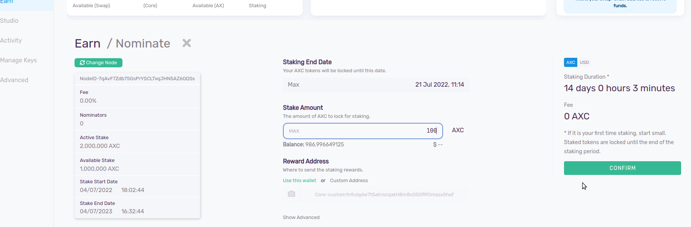
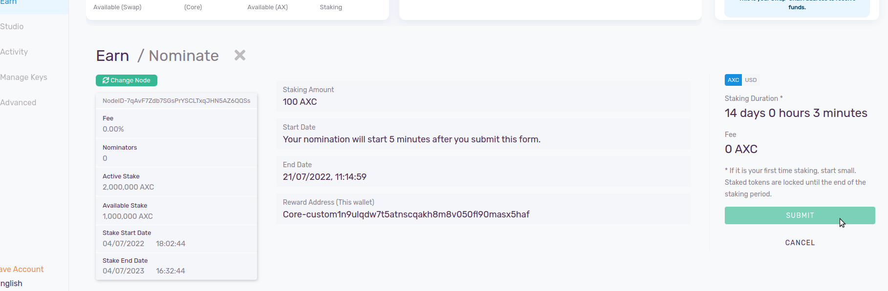
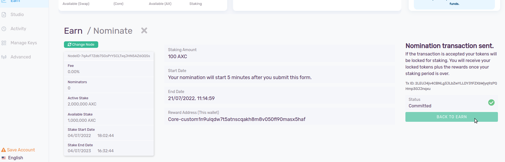
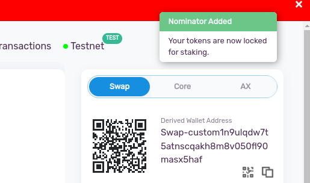
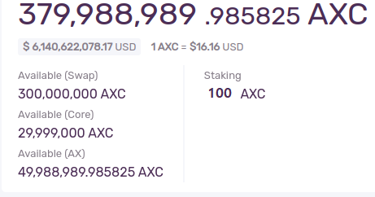
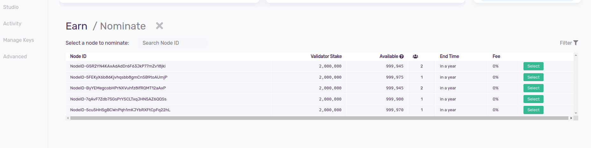

## What is Nomination ?
Nomination is the process of staking AXIA Coins to a Validator to support a network while receiving a reward in return. A Nominator can select a particular Validator from the Validator list and nominate them by staking their AXIA Coins. When they do so, they are vouching for that specific validator, and the nomination is a signal of trust in the AXIA Network. When nominating, tokens are deducted instantly and added to the total amount staked by the Nominator.

:::note A nominator should know:

* What is a Node ID? 

-> A Node ID is an identifier for a node in an remote server's address space. Nominators can identify Validators through Node IDs.

* What is Validator Stake?

-> The maximum weight of a Validator (their own stake + stake nominated to them) 5 times stake of validator (min is 100,000), max can be based on stake of a validator * 5.

* What is "No. of Nominator"?
 
-> Number of AXIA Coin users that are staking their AXIA Coin to a particular Validator.

* What is End Time? 

-> End Time is the remaining validation period for a Validator.

* What is the Fee? 

-> The fee for a Nominator is how much you have to pay to the network from your gained reward.

:::

:::caution

Nominators will receive rewards in their wallet address at the end of the nomination period as long as all of these parameters are met:

:::
## Nomination Parameters on the AXIA Network
* The minimum amount that a Nominator must nominate is 20 AXC
* The minimum amount of time one can stake funds for nomination is 120 Days
* The maximum amount of time one can stake funds for nomination is 2 years
* The minimum nomination fee rate is 2%

:::note

A Validator will receive a staking reward if they are online and responsive for more than 80% of their validation period, as measured by a majority of Validators, weighted by stake. You should aim for your Validator to be online and responsive 100% of the time.

:::
## Step by Step Nomination Process

Select the “Earn” section on the left-hand side of the wallet.

There is a Nominate tab within the Earn section. Click on “ADD NOMINATOR.” 

You can see the list of Validators which are currently active in the network. Select a Validator wisely.

Choose the staking end date. Your AXIA Coins will be locked until this date. The minimum amount of time one can stake funds for nomination is 120 days. The maximum amount of time one can stake funds for nomination is 2 years.

Then enter the amount for staking. The minimum amount that a Nominator must nominate is 20 AXC. If it is your first time staking, start small. Staked tokens are locked until the end of the staking period.

You can also select a custom address where you want to receive the rewards. If you don’t have any other wallet your rewards will be added into your current wallet.

After that you have to “CONFIRM” it.

Please review the given details. 
Then, press “SUBMIT” to confirm the transaction.

With this you can see a pop-up message on the top right corner showing “Nominator Added.”

If the transaction is accepted your tokens will be locked for staking. You will also receive a Transaction ID and the status will be committed.

You will receive your locked tokens plus the rewards once your staking period is over. You can see a new nominator is added to your selected Validator.

 [AXIA Support](https://discord.gg/axianetwork) - Connect with our community of experts to learn or ask questions.
