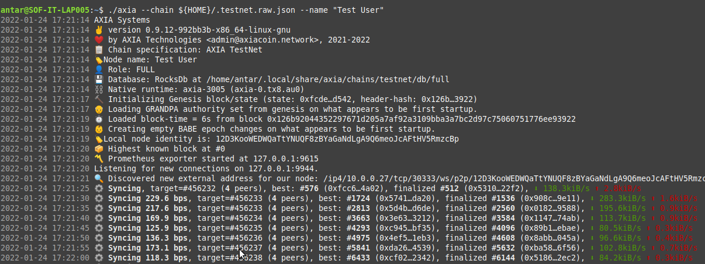

AXIA network allows one to run a full node or archive node on AXIA network. The steps mentioned below will cover all of the processes one has to follow to run a full node or archive node. However, with [Zeeve](https://www.zeeve.io) as a preferred partner for the AXIA network, you can set up a full node or archive node in an automated way and in no time without any complexity involved.

## Manual setup Requirements
To continue to set up manually, you would need a machine available to start. Most easy way is to procure a cloud VM from the choice of your cloud provider i.e. AWS or GCP etc. Next you would be required to install or get a pre-installed version of Linux operating system, we recommend using Ubuntu 20.04.4 LTS (Focal Fossa) or higher.

### Desired Hardware Specifications:
* **CPU**: Atleast, 2-4 Cores
* **RAM**: Atleast, 8-16 GB
* **DISK**: Atleast, a 180-256 GB NVMe SSD to start with may  require upgrade after 3-6 months.

You can always use more powerful machines if it's overloaded or a less powerful one, if it's underutilized. The above mentioned are standard specifications to start with, post setup one must continuously monitor its performance.

## Installing Dependencies
Once your new server is ready with a running stable linux operations system which you must have access to then you can start installing other packages and dependencies. First we will install RUST.

To check if you already have RUST installed, run the following command:
```
rustc --version
```
If the output is a valida RUST version then you will have to update it in order to proceed using the following command:
```
rustup update
```
If you don't have rust installed then please run  the following command to initiate the installation for the latest version of RUST:
```
sudo apt install curl (only if you don't have curl already installed)
```
```
curl https://sh.rustup.rs -sSf | sh -s -- -y
```
Run the following to configure your shell:
```
source $HOME/.cargo/env
```
Finally run the following to ensure you have the required dependencies installed:
```
sudo apt-get install -y git clang curl libssl-dev llvm libudev-dev expect net-tools wget librust-openssl-dev python3-dev python3 python3-pip
```
## Download the latest version of AXIA binary and configuration

Next, you will have to get the latest version of AXIA node binary and the configuration file. Follow the instructions as given below to download the binary and configuration file. Please ensure that you run these instructions inside the desired directory on the same machine.
```
RELEASE_URL="https://releases.axiacoin.network/stable/axia"
```
```
wget -c ${RELEASE_URL} ; chmod +x ./axia
```
**For Testnet**
```
wget -c https://releases.axiacoin.network/stable/testnet.raw.json -O ${HOME}/.testnet.raw.json
```
**For Mainnet**
```
wget -c https://releases.axiacoin.network/stable/mainnet.raw.json -O ${HOME}/.mainnet.raw.json
```

### Start the node
Use the following command with the exact arguments and the configuration downloaded in the previous step to start your node. As soon as your node will start, it will connect to the networks and will start syncing. Please see the screenshot below to understand what the desired output should look like.

**For Full node on testnet**

```
./axia --chain ${HOME}/.testnet.raw.json --name "Your Node Name"
```
**For Full node on mainnet**
```
./axia --chain ${HOME}/.mainnet.raw.json --name "Your Node Name"
```
**For Archive node on testnet**
```
./axia --chain ${HOME}/.testnet.raw.json --name "Your Node Name" --pruning archive
```

**For Archive node on mainnet**
```
./axia --chain ${HOME}/.mainnet.raw.json --name "Your Node Name" --pruning archive
```



If you are reading this then you have successfully completed all the required steps to set up a peer node. For more information and support, Please reachout to the support team.


[AXIA Support](https://discord.gg/axianetwork) - Connect with our community of experts to learn or ask.
