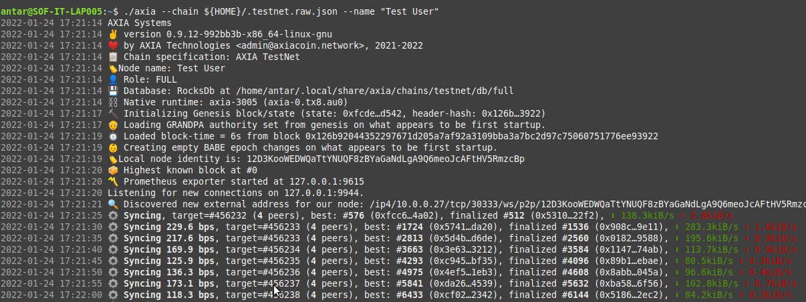
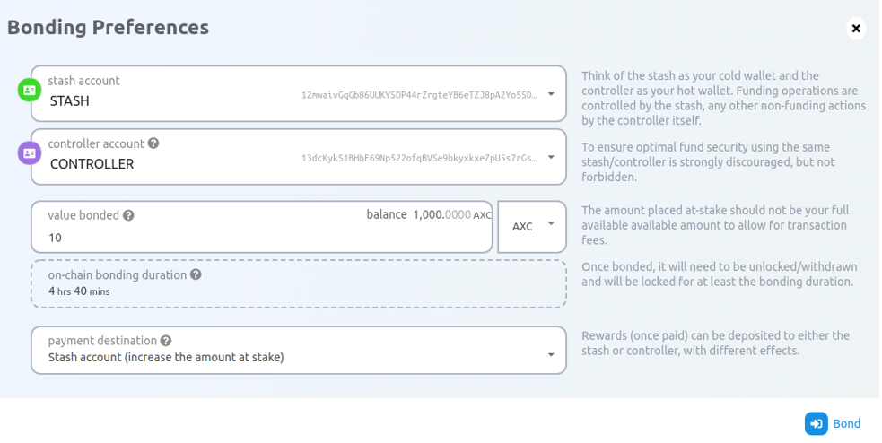
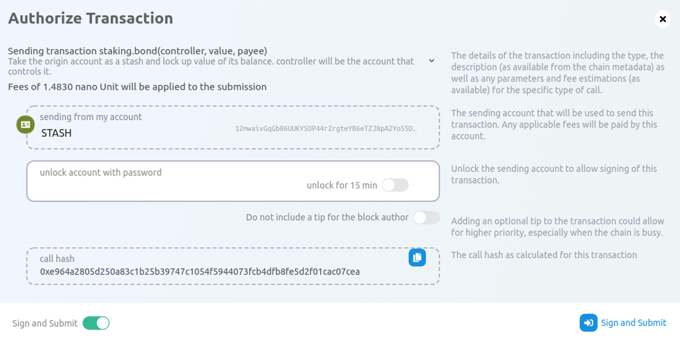
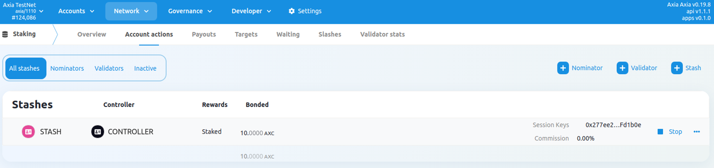
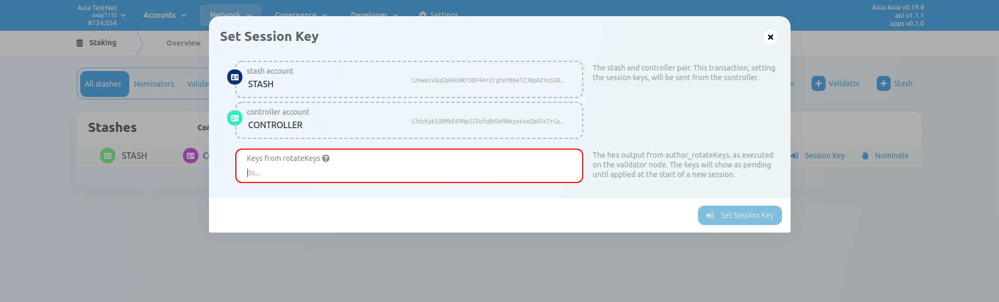
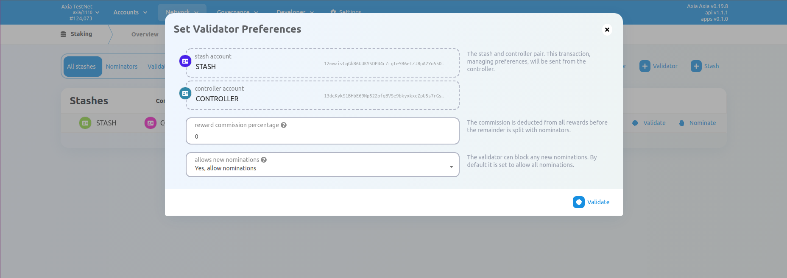

AXIA network allows one to become a validator on AXIA Mainnet. The prerequisite for becoming a validator is to complete the process at the [AXIA Capital Bank](https://web.axiacapitalbank.com/login) first and then follow these instructions carefully. For Bank related instructions, one can reach out to bank support over the appropriate support channels.

The steps mentioned below will cover all of the processes one has to follow to become a validator. However, with [Zeeve](https://www.zeeve.io) as a preferred partner for the AXIA network, you can set up the validator nodes in an automated way and in no time without any complexity involved.

## Manual setup Requirements
Running a validator node isn't just running a machine but comes attached with a lot of responsibility and accountability towards the network, its security, and decentralization. While you will also be putting your own stake, the stake of all the nominators will be your accountability as well. Any mistake or downtime can result in slashing, in turn loss to not only you, your reputations as a validator but significant loss to the nominators as well.

:::info WARNING!

Before you proceed to set up a validator manually, we recommend that you are well versed with system administration level operations, knowledgeable on Linux as an operating system as well.

You must be equipped with know-how on technical issues on the machine, cloud or for the node, that you will be able to handle and solve on your own.

:::

## How to get started
To continue to set up manually, you would need a machine available to start. Most easy way is to procure a cloud VM from the choice of your cloud provider i.e. AWS or GCP etc. Next you would be required to install or get a pre-installed version of Linux operating system, we recommend using Ubuntu 20.04.4 LTS (Focal Fossa) or higher.

### Desired Hardware Specifications:
* **CPU**: Atleast, 8 Cores
* **RAM**: Atleast, 32 GB
* **DISK**: Atleast, a 256 GB NVMe SSD to start with may  require upgrade after 3-6 months.

You can always use more powerful machines if it's overloaded or a less powerful one, if it's underutilized. The above mentioned are standard specifications to start with, post setup one must continuously monitor its performance as it directly will impact you as a validator.


## Installing Dependencies
Once your new server is ready with a running stable linux operations system which you must have access to then you can start installing other packages and dependencies. First we will install RUST.

To check if you already have RUST installed, run the following command:
```ts
rustc --version
```
If the output is a valida RUST version then you will have to update it in order to proceed using the following command:
```ts
rustup update
```
If you don't have rust installed then please run  the following command to initiate the installation for the latest version of RUST:

```
sudo apt install curl (only if you don't have curl already installed)
```
```
curl https://sh.rustup.rs -sSf | sh -s -- -y
```

Run the following to configure your shell:

```
source $HOME/.cargo/env
```

Finally run the following to ensure you have the required dependencies installed:

```
sudo apt-get install -y git clang curl libssl-dev llvm libudev-dev expect net-tools wget librust-openssl-dev python3-dev python3 python3-pip
```
### Download the latest version of AXIA binary and configuration

Next, you will have to get the latest version of AXIA node binary and the configuration file. Follow the instructions as given below to download the binary and configuration file. Please ensure that you run these instructions inside the desired directory on the same machine.

```
RELEASE_URL="https://releases.axiacoin.network/stable/axia"
```
```
wget -c ${RELEASE_URL} ; chmod +x ./axia
```
```
wget -c https://releases.axiacoin.network/stable/mainnet.raw.json -O ${HOME}/.mainnet.raw.json
```

### Start the node
Use the following command with the exact arguments and the configuration downloaded in the previous step to start your node. As soon as your node will start, it will connect to the networks and will start syncing. Please see the screenshot below to understand what the desired output should look like.
```
./axia --chain ${HOME}/.mainnet.raw.json --validator --name "Your Node Name"
```




:::info WARNING!


We must ensure that the node is appropriately in sync using the network time protocol as this will ensure that the validator will be able to send proper heartbeat on the network and also will not miss block authoring chances. Even a small error in time sync can cause the same.

:::

Wait for the node to complete the sync. Once the sync is complete, you have a validator node running and now you can proceed with registering this node on the chain and bond your stash and controller account as well.


### Creating Stash and Controller Accounts
Stash account is used very less frequently once the bonding is done, you will be able to change the controller account even while staking but will not be able to change your stash account until unbonded. It is recommended that you use two different accounts for Stash and Controller. However, the staking will still work using the same account. Stash account will be the account from which the staking of coins will take place while the controller account will help decide in starting or stopping the staking. Please ensure you have two different accounts created already before proceeding forward else do create two unique accounts using the AXscan Account menu on the top.

To start, navigate to Staking on the AXscan and click Account Actions and click Add Stash [+ Stash] button on the right top of the screen. Please ensure that you will be able to see the following popup, start filling the Stash and Controller keys against the Stash and Controller account respectively.

The third option is to set the coins you would like to bond por stake out of your available stash balance. You will not be able to unbond these tokens before 28 days from the day you will initiate unbonding.



Last option on the wizard is to select the payout destination, this is the account where you would like the rewards to be given post claim.

Once you are assured that every detail is filled appropriately then you can proceed to bond by signing the transaction using your Stash account. Please ensure you have enough coins left to pay the fee for the transaction.



Once submitted, the transaction will be complete in a few seconds and you will see the success confirmation notification on the top right corner of AXscan. Also, your stash account will be available under the stashes as well.


### Register Session keys
Please ensure your node is fully synched before you proceed with these steps. To generate the session keys you will need to make an RPC call to the new node you are preparing. Please ensure you are on the same machine and never execute this from a remote location. You can initiate the key generation using the following command on your node:

```
curl -H "Content-Type: application/json" -d '{"id":1, "jsonrpc":"2.0", "method": "author_rotateKeys", "params":[]}' http://localhost:3102
```
 
Once the above command is complete, you will receive a hex response, please save this response as it is required to complete your set session key transaction.

:::info WARNING!

Session keys are the most critical bit for any validator node. If these are setup wrong the node will not work properly.

:::

Please navigate to Staking - Account Action from the top menu of AXscan. This transaction will attach your validator node with your controller account.



Click the Session key in front of your newly created stash account. The following wizard will open up:



Fill in the hex output from the curl RPC command you saved earlier and click the set session key to complete the transaction. Click the Validate in front of your newly created stash account. The following wizard will open up:



Select, Stash account, Controller account as created previously and also select the commission for your validator. 100% commission means you won't be paying any nominator at all. And in the end, you can choose if you want nominators to be able to nominate you as a validator on the Network. On clicking Validate you will be put to the pending state until the next session triggers. You will also be able to see your validator under the Staking tab on AXscan top menu.

Alternatively you can also click on + Validator button on Staking - Account Action navigation from the top menu. Fill in your Stash and controller account, fill in the coins to be staked/bonded. Also select the payout destination when the rewards are to be claimed.

Next will take you to the second step which is to fill the hex output from the curl RPC command, the commission for your validator. 100% commission means you won't be paying any nominator at all. And in the end, you can choose if you want nominators to be able to nominate you as a validator on the Network. On clicking Bond and Validate you will be put to the pending state until the next session triggers. You will also be able to see your validator under the Staking tab on AXscan top menu.

If you are reading this then you have successfully completed all the required steps to set up a validator node. For more information and support, Please reach out to the support team.


[AXIA Support](https://discord.gg/axianetwork) - Connect with our community of experts to learn or ask.
